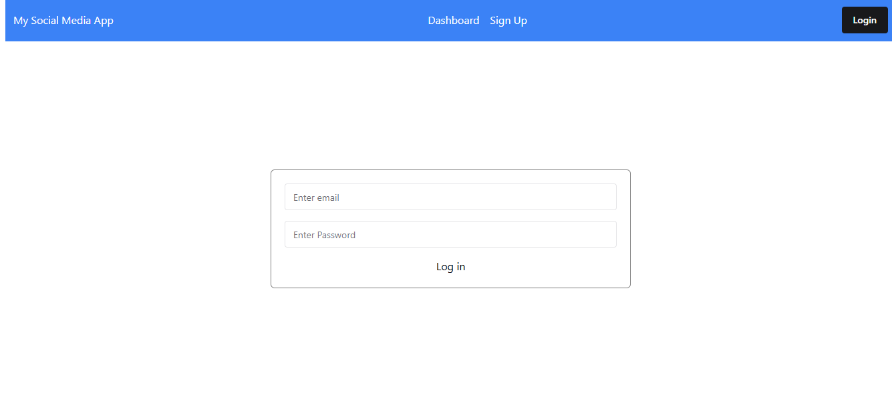
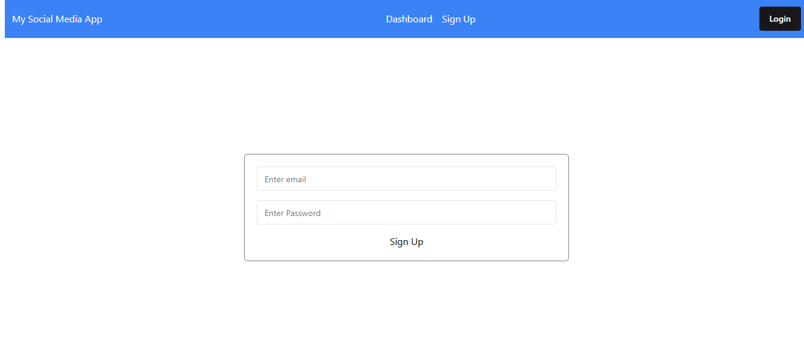
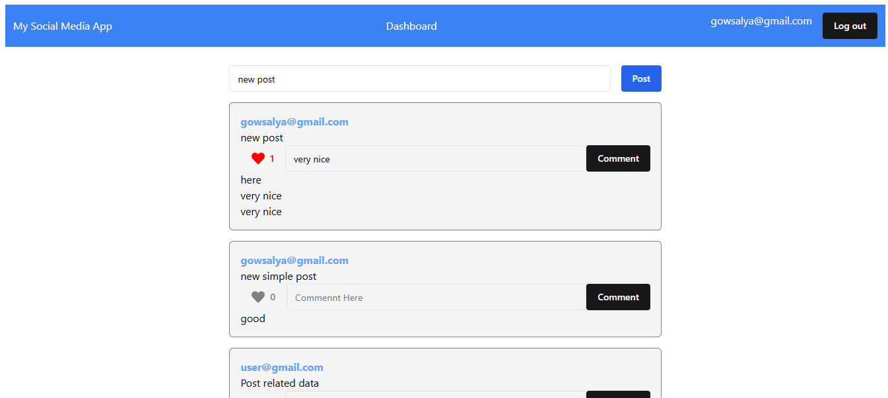
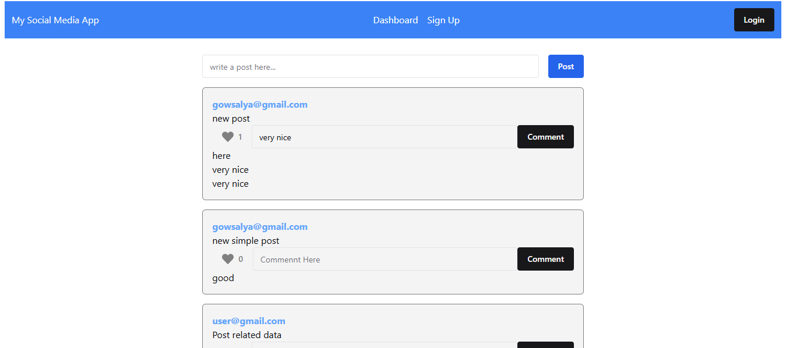

# Simple Social Media App

# Introduction
   ###  
   The Simple Social Media App is a basic social media platform that allows users to sign up, log in, and interact with posts through liking and commenting. The app leverages Firebase for both user authentication and real-time data management.

# 💻 Tech Stack:

 

# 💻 DEPLOYED LINK:
    https://simple-social-media-app-ca3d5.web.app/

# DIRECTORY STRUCTURE

    Login =>  Dashboard
    Signup => Login => Dashboard

# FEATURES
###
✧ Firebase Authentication: Users can sign up using their credentials (email and password) and log in to access their personalized experience. The app uses Firebase Authentication to securely manage user credentials.
    
✧ User Dashboard: After logging in, users are redirected to a Dashboard page where they can view their email address at the top of the page, confirming their login.
On this page, users can:
Create New Posts: Users can post text content and add posts to the feed.
Like Posts: Posts can be liked or unliked by users.
Comment on Posts: Users can add comments on posts to engage in discussions.
    
✧ Signup Procss: New users can create an account using their email and password. Upon successful registration, they are logged in and taken to the Dashboard page.The sign-up process requires the user to input their email, password, and confirm the password for verification.
 
✧ Skills Section: A well-structured list of technical competencies, accompanied by intuitive icons and progress bars that highlight my proficiency with each tool or technology.
    
✧ Firebase Integration: Firebase Realtime Database is used to store and retrieve posts, likes, and comments. Firebase Authentication handles user sign-ups and log-ins, ensuring secure access and management of user data.

# 💻 SCREENSHOTS:

